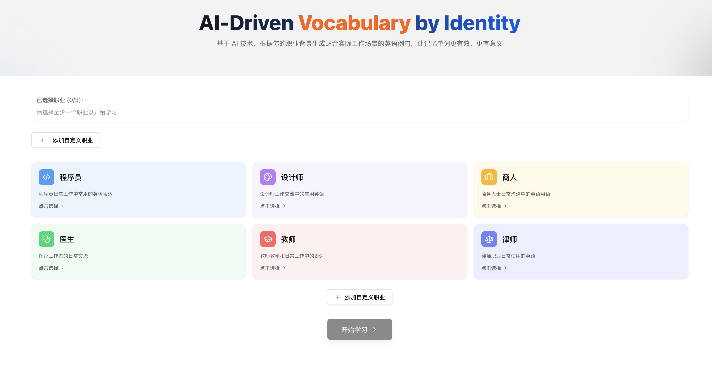

# ProWords

<p align="center">
  
  
  
</p>

<p align="center">🇨🇳 <a href="#chinese">中文</a> | 🇺🇸 <a href="#english">English</a></p>

---

<h2 id="chinese">中文介绍</h2>

## ProWords - AI + 身份，让单词记忆更有趣、更有效

ProWords 是一个基于人工智能的专业化英语学习平台，为不同职业的人群提供量身定制的英语学习体验。通过整合先进的AI技术，为用户创建职业相关的例句和学习内容。

### 🌟 特色

🎯 **职业场景定制**：支持多种职业身份组合以及自定义身份，生成贴近工作场景的例句

📚 **丰富词库支持**：覆盖 CET4/6、GRE、TOEFL、IELTS、考研等多个考试词库

🤖 **AI 智能例句**：不满意可一键重新生成，直到符合你的需求

💾 **进度自动保存**：随时可以继续上次的学习进度

🌓 **深色模式**：提供舒适的阅读体验

### 💻 技术栈

- **前端框架**: Next.js 14
- **UI 组件**: Tailwind CSS + Shadcn/ui
- **动画效果**: Framer Motion
- **AI 集成**: 集成先进大语言模型API
- **状态管理**: React Hooks
- **本地存储**: localStorage

### 📚 功能特点

#### 职业选择
- 预设职业类型（程序员、设计师、医生等）
- 支持自定义职业描述
- 可多选职业组合，获得多样化的例句

#### AI学习系统
- 丰富词库支持：
  - CET-4/6（大学英语四六级）
  - GRE（美国研究生入学考试）
  - TOEFL（托福考试）
  - IELTS（雅思考试）
  - PTE（培生英语考试）
  - 考研英语
- 按章节学习
- 自动保存进度
- AI智能例句生成
- 例句重生成功能

### 📸 应用截图

<div align="center">
  
  <p><em>主界面 - 职业背景选择</em></p>
  
  
  <p><em>单词学习 - AI生成的专业例句</em></p>
  
  
  <p><em>进度追踪 - 章节完成统计</em></p>
</div>

#### 界面功能
- 深色模式支持
- 响应式设计
- 流畅的过渡动画
- 直观的进度展示

### 📍 开始使用

1. 克隆项目
```bash
git clone <repository-url>
cd prowords
```

2. 安装依赖
```bash
pnpm install
```

3. 启动开发服务器
```bash
pnpm run dev
```

4. 访问应用
```
http://localhost:3000
```

### 💯 使用流程

1. 选择职业身份
2. 选择词库类型：
   - CET-4/6（大学英语四六级）
   - GRE（美国研究生入学考试）
   - TOEFL（托福考试）
   - IELTS（雅思考试）
   - PTE（培生英语考试）
   - 考研英语
3. 选择学习章节
4. 开始学习单词
5. 查看AI生成的职业相关例句
6. 不满意可一键重新生成例句

### ☕ 支持项目

<p align="center">
  <a href="https://www.buymeacoffee.com/winterfx" target="_blank">
    
    <br>
    
  </a>
</p>

如果这个项目对你有帮助，欢迎请我喝杯咖啡支持一下！您的支持将帮助我持续改进这个项目。

---

<h2 id="english">English Introduction</h2>

## ProWords - AI + Professional Identity: Making Word Memorization More Engaging and Effective

ProWords is an AI-powered English learning platform that provides tailored learning experiences for professionals across various industries. By integrating advanced AI technology, it creates career-relevant example sentences and learning content for users.

### 🌟 Features

🎯 **Professional Scenario Customization**: Support for multiple professional identities and custom roles, generating examples that closely match work scenarios

📚 **Rich Vocabulary Support**: Covers multiple exam vocabularies including CET4/6, GRE, TOEFL, IELTS, and Kaoyan

🤖 **AI-Powered Examples**: One-click regeneration until you get the perfect example sentences

💾 **Auto-Save Progress**: Continue from where you left off at any time

🌓 **Dark Mode**: Provides a comfortable reading experience

### 💻 Tech Stack

- **Frontend Framework**: Next.js 14
- **UI Components**: Tailwind CSS + Shadcn/ui
- **Animation**: Framer Motion
- **AI Integration**: Advanced language model API integration
- **State Management**: React Hooks
- **Local Storage**: localStorage

### 📚 Key Features

#### Career Selection
- Preset professional types (programmer, designer, doctor, etc.)
- Support for custom profession descriptions
- Multiple profession selection for diverse example sentences

#### AI Learning System
- Comprehensive Dictionary Support:
  - CET-4/6 (College English Test)
  - GRE (Graduate Record Examination)
  - TOEFL (Test of English as a Foreign Language)
  - IELTS (International English Language Testing System)
  - PTE (Pearson Test of English)
  - Kaoyan (Chinese Postgraduate Entrance Examination)
- Chapter-based learning
- Automatic progress saving
- AI-powered example sentence generation
- Sentence regeneration functionality

### 📸 Screenshots

<div align="center">
  
  <p><em>Main Interface - Professional Background Selection</em></p>
  
  
  <p><em>Word Learning - AI-Generated Professional Examples</em></p>
  
  
  <p><em>Progress Tracking - Chapter Completion Statistics</em></p>
</div>

#### Interface Features
- Dark mode support
- Responsive design
- Smooth transition animations
- Intuitive progress visualization

### 📍 Getting Started

1. Clone the project
```bash
git clone <repository-url>
cd prowords
```

2. Install dependencies
```bash
pnpm install
```

3. Start the development server
```bash
pnpm run dev
```

4. Visit the application
```
http://localhost:3000
```

### 💯 Usage Flow

1. Choose your professional identity
2. Select vocabulary type:
   - CET-4/6 (College English Test)
   - GRE (Graduate Record Examination)
   - TOEFL (Test of English as a Foreign Language)
   - IELTS (International English Language Testing System)
   - PTE (Pearson Test of English)
   - Kaoyan (Chinese Postgraduate Entrance Examination)
3. Choose learning chapter
4. Start learning words
5. View AI-generated profession-related examples
6. One-click regeneration if you're not satisfied

### ☕ Support the Project

<p align="center">
  <a href="https://www.buymeacoffee.com/winterfx" target="_blank">
    
    <br>
    
  </a>
</p>

If this project has been helpful to you, consider buying me a coffee! Your support will help me continue improving this project.

### 🔧 Environment Setup

1. Create a `.env.local` file in the project root:

```bash
# Create .env.local file
touch .env.local
```

2. Add the following required environment variables to the `.env.local` file:

```bash
NEXT_PUBLIC_BASE_URL=your_api_base_url
NEXT_PUBLIC_OPENAI_API_KEY=your_api_key
```

Example:
```bash
NEXT_PUBLIC_BASE_URL=https://api.rdsec.trendmicro.com/prod/aiendpoint/v1/
NEXT_PUBLIC_OPENAI_API_KEY=your_jwt_token_here
```

These environment variables are essential for the application to connect to the required APIs.

## 📜 License

MIT License

## Star History

[](https://star-history.com/#winterfx/ProWords&Date)